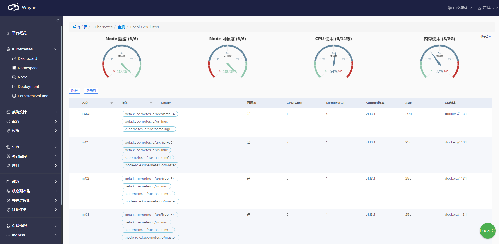
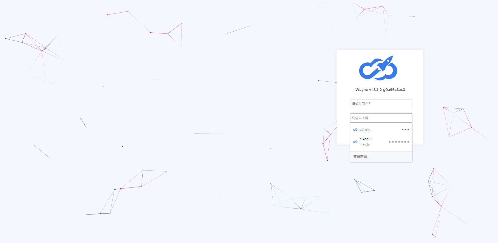
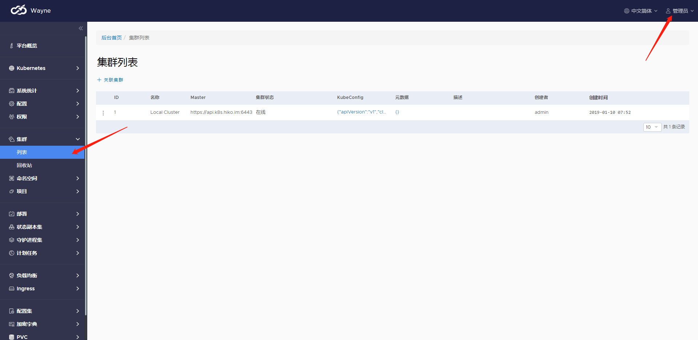
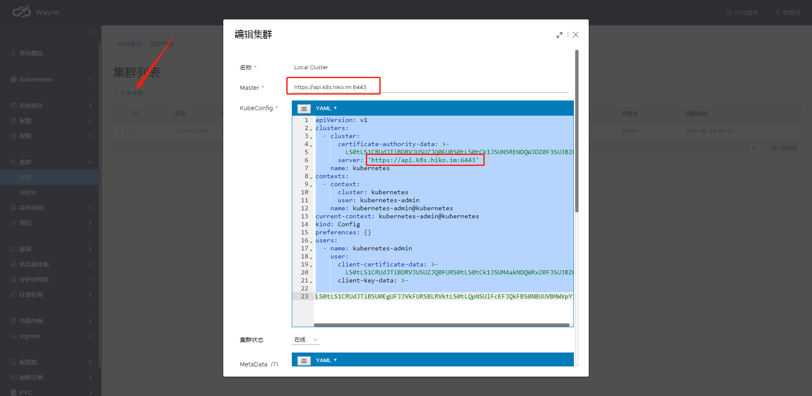
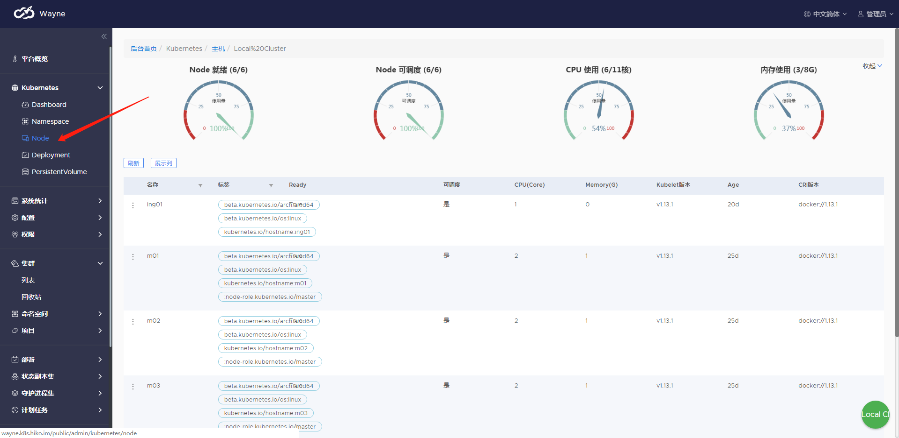

Wayne： 360 开源 kubernetes 多集群管理平台
---

- [Qihoo360/wayne](https://github.com/Qihoo360/wayne)
- [Wayne wiki](https://github.com/Qihoo360/wayne/wiki)




## 1. 基础配置

安装 Wayne 跟安装普通的应用没太大的区别，通过 `kubectl apply -f *.yaml` 进行相关依赖和程序的安装。

Wayne 提供了知道文档，具体参考：[wiki](https://github.com/Qihoo360/wayne/wiki)


Wayne 的仓库中提供了部署所需的 yaml 配置文件，见：[hack/kubernetes](https://github.com/Qihoo360/wayne/tree/master/hack/kubernetes)

其中有两个目录：[dependency](https://github.com/Qihoo360/wayne/tree/master/hack/kubernetes/dependency)、[wayne](https://github.com/Qihoo360/wayne/tree/master/hack/kubernetes/wayne)


分别下载并通过 `kubectl apply -f .` ，先安装 denpendency 中的 MySQL 和 RabbitMQ，再安装 wayne、wayne-webhook 和 wayne-woker。

因为官方提供的配置比较高，我自己调整了配置进行安装，具体配置见：[wayne/v1.3.1](./v1.3.1)

另外，为了通过域名访问服务，我增加了 `ingress` 配置，具体配置见：[wayne/v1.3.1/wayne/ingress.yaml](./v1.3.1/wayne/ingress.yaml)

## 2. 安装

### 2.1 安装依赖（MySQL 和 RabbitMQ）

进入 dependency 目录，执行 `kubectl apply -f .`，查看所有的 pod:

```
[kube@m01 ~]$ kubectl get pod
NAME                                   READY   STATUS    RESTARTS   AGE
mysql-wayne-df7c8c595-nmss2            1/1     Running   0          6h20m
rabbitmq-wayne-6cc64bbd99-8fj5d        1/1     Running   0          6h20m

```

看到 mysql-wayne 和 rabbitmq-wayne 的 pod 已经启动完成。

### 2.2 安装 wayne 后端程序

进入 [wayne 目录](./v1.3.1/wayne)，执行 `kubectl apply -f .`，查看所有的 pod:

```
[kube@m01 ~]$ kubectl get pod
NAME                                   READY   STATUS    RESTARTS   AGE
infra-wayne-7ddd7f4b9c-spcjq           1/1     Running   0          105m
infra-wayne-webhook-58995d89c5-kf9dr   1/1     Running   0          105m
infra-wayne-woker-57685f749d-x8nmn     1/1     Running   0          105m
mysql-wayne-df7c8c595-nmss2            1/1     Running   0          6h20m
rabbitmq-wayne-6cc64bbd99-8fj5d        1/1     Running   0          6h20m

```

所有的 pod 正常运行，查看 ingress 配置：

```
[kube@m01 ~]$ kubectl get ing
NAME            HOSTS               ADDRESS   PORTS   AGE
wayne-ingress   wayne.k8s.hiko.im             80      114m

```

### 2.3 访问

将 wayne.k8s.hiko.im 解析到 k8s 集群的 ingress 机器，再通过浏览器访问：http://wayne.k8s.hiko.im , 将看到：



## 3. 配置集群

默认管理员账号：admin，密码：admin

通过右上角 [管理员] -> [进入后台] 进入管理端，如下：



### 3.1 关联集群

为了让 wayne 能管理我们的 kubernetes 集群，我们需要在管理端关联集群。




其中，KubeConfig 可以从 m01 (api-server 的机器上)，对应用户（比如：本教程中使用的 kube 用户）的 `~/.kube/config` 文件查看。

本实例配置如下：

```
apiVersion: v1
clusters:
- cluster:
    certificate-authority-data: LS0tLS1CRUdJTiBDRVJUSUZJQ0FURS0tLS0tCk1JSUN5RENDQWJDZ0F3SUJBZ0lCQURBTkJna3Foa2lHOXcwQkFRc0ZBREFWTVJNd0VRWURWUVFERXdwcmRXSmwKY201bGRHVnpNQjRYRFRFNE1USXlNVEF6TVRBd00xb1hEVEk0TVRJeE9EQXpNVEF3TTFvd0ZURVRNQkVHQTFVRQpBeE1LYTNWaVpYSnVaWFJsY3pDQ0FTSXdEUVlKS29aSWh2Y05BUUVCQlFBRGdnRVBBRENDQVFvQ2dnRUJBTFVEClM0ejhidmM3c05Xc3l3YmVnUDFPZGNlRmlWclhRbHZGOXl1UWpKeFVKYTFUWHVHVGFwQkNtVGIwZjlNUTBIc0MKYk9XY3hZUkkwVDFBSVlMNmZsbWFobXdiV0Q5TDVXak5GNGdOdmNFazdpNnd1a090dVpzK2tZcSszMXNYYjNDZQp6TTNqWUcrV3FnaTZ5N0FPTEZLMmNsNFVwbTJJQVBpbUdDaHI1MnIxTHBwalpLODRMQmo5MUNkN0NyYVI2OEx1CkQ2RDdIRnkxT1lVbHZ1N01VenA5T3hZVFBwZE1DMndXc0hsOFZJWDNpYVZtZVNhTDYwS0x4bDFjQ1l2d0dpanAKdzlCbVBtN2xobzJFMERmV2tMc2tEVkdsUUEyT2t0MFkrMkl5ZXZ2Yy9uZ0N6MEFhN0NZZ1hwQ3JhNHJyWUhieAp3bzRaWXNST0RJditubVVhVzMwQ0F3RUFBYU1qTUNFd0RnWURWUjBQQVFIL0JBUURBZ0trTUE4R0ExVWRFd0VCCi93UUZNQU1CQWY4d0RRWUpLb1pJaHZjTkFRRUxCUUFEZ2dFQkFFTWpDeHh3a0NWNXJhM2NHMW1SOGJQbzIxV20KNXlUNS9rbE81cjRiMGlQSll0ZEM1VGc4ck9DU2lyN1JtSmJLYzYybVNhcVNvandIWW9YQk1rb1lROGo0Z1dnNgpPTWtJZlpaYTkzMFBlUG5ZNUVrekxSVXg2cnREMFVoSFJwakpaOWF0QmtqU1ZsNmptZEVQWEROMUFGSmtUVjdhCjdGZVhFdTZ6RDJhVHZoVjAyL2lwOGx2MFdhd3VJTXh6K1hyQkNQRlR1MWwydEUvd0VRVzVNb1F3bGdYOW1ZeTcKSVV1dENRWkREV0REQ0hCY1dMa0ZMN0F0UlVBa1JoTlk0K2dRZ29USnRGSmMzR0pER2Vkb1gwcHNRT3ExL1Z2egpicmw4ZHpPbWJ5L056MmZuZHFBNlpzemFHaUd5czJCTS9kUDh3MGsrbFhVSS9YTTFsdHZHZlZwdEpNWT0KLS0tLS1FTkQgQ0VSVElGSUNBVEUtLS0tLQo=
    server: https://api.k8s.hiko.im:6443
  name: kubernetes
contexts:
- context:
    cluster: kubernetes
    user: kubernetes-admin
  name: kubernetes-admin@kubernetes
current-context: kubernetes-admin@kubernetes
kind: Config
preferences: {}
users:
- name: kubernetes-admin
  user:
    client-certificate-data: LS0tLS1CRUdJTiBDRVJUSUZJQ0FURS0tLS0tCk1JSUM4akNDQWRxZ0F3SUJBZ0lJV2FYTUtqMmRnTWt3RFFZSktvWklodmNOQVFFTEJRQXdGVEVUTUJFR0ExVUUKQXhNS2EzVmlaWEp1WlhSbGN6QWVGdzB4T0RFeU1qRXdNekV3TUROYUZ3MHhPVEV5TWpFd016RXdNRFphTURReApGekFWQmdOVkJBb1REbk41YzNSbGJUcHRZWE4wWlhKek1Sa3dGd1lEVlFRREV4QnJkV0psY201bGRHVnpMV0ZrCmJXbHVNSUlCSWpBTkJna3Foa2lHOXcwQkFRRUZBQU9DQVE4QU1JSUJDZ0tDQVFFQTFlaWNXUnp5MnJPOVFuWmEKU1ZVTHIyL2hvemwyTWFhTjkzemRmYkIvNTA0YUtGQXFjWUNCWkpwL0V0NFlwTitOaGFKWDRtS1YvdGdtanpLawpRSzFjdStHSlhiWllQd0pzUE5QcXh3TURJRitmTHpZMk1MSk9ScG1VOTVabFBCanNTa0J6YlpoQ2JZRzhuYXZXCkxqNlBLNXpLVldWRXVucXRFWDMwS0FPRHorOXZvS3BKck1Bd3RIb2lyZjk3SThIdnV5dVhLanBYOW94d2gyRVoKdDRUNVFVU0M5bnRpWWUwQnV0MlNBQytYdDBWaElYd3I0QWIzQzJhSTE2MFR3SWV0Ums1bS9KcGYrd2ZoOXc3MgpiejM3eDJJNUJwQmZsY1R2S3pjMUZ1cjZ6eXJqaWVGV05uQ3RiSFg2R0R6akJ0ODlOZTN5NDFpaUovYWFITUhTClcyWmhNUUlEQVFBQm95Y3dKVEFPQmdOVkhROEJBZjhFQkFNQ0JhQXdFd1lEVlIwbEJBd3dDZ1lJS3dZQkJRVUgKQXdJd0RRWUpLb1pJaHZjTkFRRUxCUUFEZ2dFQkFBbmxjRTVwL1QrQnhtRkVJZG9idENWWlJ4UC8vVk9KbDg4YQp3VHd0MmpsaFhLNitMSlYrZUZqTzV5WStPZU01bXo5TjRjRGFoSnhpbVlaTzRFT1kwUWJoaHp4OXhvcUt0QTlNCk9HRFRHbitwNUhwOS83emxtYWhxZERQbHpWNXFUTW1uZG1VeXBEdnRwU0d0amlUR1JFRG5KcWlkVlB3ZlhqNU0KMVI3MTd5ZjI3bjNSR05xRHhyeUloay9oZ0lvSXJNOEZRekFDRkhMMnlQUVFzQUc5ZGdxTVR3amJ0WGxacW16UAp2ZnNCQjIxVHV2YzdWd1A2b05sbVpRcnpJb2FRbmMrVm9tSTRVSmFDYWQ0MkxVL0Y4V3FIbjBMYUJqbHFaOFhpClUxcm03TG1HR1NOczVoM3p3OWg5Y0dNVGNQQ0NEUktIN0gza1FPVFc5dGpIbjd4YS9qTT0KLS0tLS1FTkQgQ0VSVElGSUNBVEUtLS0tLQo=
    client-key-data: LS0tLS1CRUdJTiBSU0EgUFJJVkFURSBLRVktLS0tLQpNSUlFcEFJQkFBS0NBUUVBMWVpY1dSenkyck85UW5aYVNWVUxyMi9ob3psMk1hYU45M3pkZmJCLzUwNGFLRkFxCmNZQ0JaSnAvRXQ0WXBOK05oYUpYNG1LVi90Z21qektrUUsxY3UrR0pYYlpZUHdKc1BOUHF4d01ESUYrZkx6WTIKTUxKT1JwbVU5NVpsUEJqc1NrQnpiWmhDYllHOG5hdldMajZQSzV6S1ZXVkV1bnF0RVgzMEtBT0R6Kzl2b0twSgpyTUF3dEhvaXJmOTdJOEh2dXl1WEtqcFg5b3h3aDJFWnQ0VDVRVVNDOW50aVllMEJ1dDJTQUMrWHQwVmhJWHdyCjRBYjNDMmFJMTYwVHdJZXRSazVtL0pwZit3Zmg5dzcyYnozN3gySTVCcEJmbGNUdkt6YzFGdXI2enlyamllRlcKTm5DdGJIWDZHRHpqQnQ4OU5lM3k0MWlpSi9hYUhNSFNXMlpoTVFJREFRQUJBb0lCQUZjcXJOdWJjbE13djBUZwpHYmFjVTJDd1JOQlEwQnMzZGM2T01XdlFpcTVsSXorZU8wMTVRa0VPdkEyaU40U29ISEdDVURIT1hyVTB1N0hLCnZ5Z2ovUkFLdmdGVUZ1M0dQUGtrbWgxeTJzbE1iZis5SmFQK1pPdGNGbG8yRFJiS1NTK1F4L2kyL1FyR3ZXZTYKNkZKNzU3ZXI4citOdnM0R3c1UEhNY0ZFZldnenVSOVVRSFM0Tis4N3Yvc0k5NUd4dFZpcXQxTzkyMFJiV3FrZgpqVWVFZkNHeFdrVDhjNXgydnkwK05MdjgrQWJCVVJ6cXhtL0NnWEp3b0F2RVhzR1NYOFJybjNWR1JpZnNsNUwwCjl6c2pvVG1FNkdtV1prYUE3b1FpeHdxWVpoZG05RW9zTjdSNFFJMXVjMjN0UmRKOUhjdXhacktZZXhvY1NFUjEKTFNxNlVTa0NnWUVBNmRpV0tmdDhwTmlodVdKVzJIYjB2TlJzaWhZaHZjQmtUYnVlc1o2UHAvRGpNYkZ2ZmhtcQpRV21qUGk3Q3V3dU5qZzhrNEZZNmJrQS9wM1A4eUVvUkxGRDRqaXZycTMyWTNhYm1IUUJqd2NQZmxlellkWmp3CkpQYm0vdjVoRUNXRzk0WG5wR1ZUOUlNTzJIdFBaRXkxV0xycFoyU3FraFpuQjlZaWd0bzVybHNDZ1lFQTZpeDgKcG13SFByZU9hbjd2R3RzdlZETDBDckppdXRJVERuTTkxSStUY3drTUQ2a3NacmZIZXdMNWk5L1RlQXFDWk9pZgoyTmtRbzlFT1d1cEtFTzZaNjVWMm9ibm90SGdLQzFDc0NpVzVKdU4wTTVMbEpEUVhlbjlNK3F0bVJSUVNXcUFrCnNxeElvb3FXelpsUkUwcUpjUThibXRBbUFRTmNTSTJ5ZkdMeUhHTUNnWUJ1bnJCYVo4Y016QldrOXFvU2VDTkoKK0Vybi81UXlpUUpwNnlrazZOY1lJTkc0dmpENXUvWllQenFqdmNjTWFHaXNIT25hM2ErQ1hBNUFqcE96dzZYZwpDdVdwaTRsT2RIbU4wTmZtUERyMGZFNFdSQllaZXlHT3V1V0hGcHFmNHNDMzhyWWpoSE4wcFZLdWdaYUs0ZWFmCmRMdlkxendCSTJ2VnZ5eFFMaDgvSlFLQmdRQzRVVXZMc2p3Qm9YajNXZkhac2F3UEdndjhYMnhXb0FOZjNGVk8KZWJRVlY0bW15Z0dvMS82clZDd1hiSldHWnI4N3JkNGpVTGRJT2NTU3l0YUJmVXlwb1hzKzBKWFpkcUp4Ulk0awpib3pOanpwblhiZitSd0l6NlA4dVRycXdwSnZOdVQ4cFkzSElmazAwaHZqSnRtRjRHK3dlYnJkN0ZLb09jWG1MCmJsWWpBUUtCZ1FDMTQ0bkorSDVPdWpGREozenRWditoNGMrQk04b09od1JCUVVJclNuWG1MN0lXVU91ZXI1TzYKYnhIamlkSnVPMlNYYWtmWXdyMDBoZEhRVDFubEZTZ3lEaGdkY01Jd1AwcmYySUNPMHJpekFyVkZCTlFMcUdmNApBcjZoVEFEcUd4bElScGEwYmhmeGpDd2VxZ3cwVUUyVnNNd1lNVVZyMzFmeDRIZktwaXBPZkE9PQotLS0tLUVORCBSU0EgUFJJVkFURSBLRVktLS0tLQo=

```

配置完保存即可。

点击 [kubernetes] -> [Node] 将看到节点实况：



## 4. 问题排查

可以通过 kubectl get pods 查看 pod 的状态，以及 kubectl logs -f {POD 实例名称} 查看 POD 输出的日志进行问题排查，如下：

```
[kube@m01 ~]$ kubectl get pods
NAME                                   READY   STATUS    RESTARTS   AGE
infra-wayne-7ddd7f4b9c-spcjq           1/1     Running   0          130m
infra-wayne-webhook-58995d89c5-kf9dr   1/1     Running   0          130m
infra-wayne-woker-57685f749d-x8nmn     1/1     Running   0          130m
mysql-wayne-df7c8c595-nmss2            1/1     Running   0          6h46m
rabbitmq-wayne-6cc64bbd99-8fj5d        1/1     Running   0          6h46m


[kube@m01 ~]$ kubectl logs -f infra-wayne-7ddd7f4b9c-spcjq
2019/01/10 12:21:41.942 [I] [asm_amd64.s:2361] http server Running on http://:8080
2019/01/10 12:21:41.942 [I] [asm_amd64.s:2361] Admin server Running on :8088

```